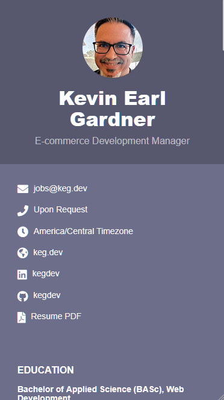

# KEGdev Online CV

A customized version of the Orbit Jekyll theme, tailored for professional e-commerce development managers and technical leaders. This fork includes enhanced PDF generation capabilities and personalized styling.

## Original Theme Credits

> **Original Theme:** Orbit by Xiaoying Riley at [3rd Wave Media](http://themes.3rdwavemedia.com/)  
> **Jekyll Implementation:** [sharu725/online-cv](https://github.com/sharu725/online-cv)  
> **Original Demo:** [online-cv.webjeda.com](https://online-cv.webjeda.com)

## Customizations in This Fork

This version includes several enhancements over the original theme:

- **Advanced PDF Generation**: Custom Node.js script using Playwright for high-quality PDF output
- **Enhanced Styling**: Improved ceramic theme with better typography and layout
- **Professional Sections**: Added certifications section with credential links
- **Optimized Layout**: Better responsive design and print-friendly formatting
- **Custom Content**: Tailored for e-commerce development professionals

<table>
  <tr>
    <th>Desktop View</th>
    <th>Mobile View</th>
  </tr>
  <tr>
    <td>
        
    </td>
    <td>
        
    </td>
  </tr>
</table>

**Live Demo:** [cv.keg.dev](https://cv.keg.dev)

## Quick Start

* [Fork](https://github.com/kegdev/online-cv/fork) this repository
* Go to settings and set main branch as GitHub Pages source
* Your new site should be ready at `https://<username>.github.io/online-cv/`
* Edit `_data/data.yml` to customize with your information

## PDF Generation

This fork includes an enhanced PDF generation system:

```bash
# Install dependencies
npm install

# Build the Jekyll site first
bundle exec jekyll build

# Generate PDF
npm run generate-pdf
```

The PDF will be saved to `assets/pdf/cv-keg-dev-print.pdf` with professional styling and layout optimization.

## Development Setup

### Docker Development (Recommended)

```sh
docker-compose up
```

The site will be available at <http://localhost:4000>. Changes to `_data/data.yml` will be reflected after Jekyll rebuilds.

### Local Development

```bash
# Clone the repository
git clone https://github.com/kegdev/online-cv.git
cd online-cv

# Install Ruby dependencies
bundle install

# Install Node.js dependencies (for PDF generation)
npm install

# Serve the site locally
bundle exec jekyll serve

# Navigate to http://localhost:4000
```

### PDF Generation Requirements

- Node.js 18+ 
- Playwright (automatically installed via npm)
- Jekyll site must be built first (`bundle exec jekyll build`)


## Customization Features

### Enhanced Sections

- **Certifications**: Professional certifications with credential links and verification
- **Advanced Skills**: Detailed proficiency levels with visual progress bars
- **Career Timeline**: Comprehensive experience tracking with detailed descriptions
- **PDF Optimization**: Print-friendly layouts with preserved styling

### Configuration

All content is managed through `_data/data.yml`:

```yaml
# Personal Information
sidebar:
  name: Your Name
  tagline: Your Professional Title
  avatar: profile.png  # Place in /assets/images/
  
# Professional sections
experiences: # Work history
certifications: # Professional certifications  
skills: # Technical skills with proficiency levels
education: # Academic background
```

## Available Themes

The original theme includes 6 color schemes. This fork uses the ceramic theme by default with enhanced styling optimized for professional e-commerce developers.

**Current Implementation:** [cv.keg.dev](https://cv.keg.dev) showcases the ceramic theme with custom enhancements.

For reference, the original theme color options include:

| Blue | Turquoise | Green |
|---------|---------|---------|
|  |  |  |

| Berry | Orange | Ceramic |
|---------|---------|---------|
|  |  |  |

## Credits & Acknowledgments

### Original Theme
- **Designer**: [Xiaoying Riley](http://themes.3rdwavemedia.com/) at 3rd Wave Media
- **Jekyll Implementation**: [sharu725](https://github.com/sharu725) 
- **Contributors**: [Nelson Estevão](https://github.com/nelsonmestevao), [t-h-e(sfrost)](https://github.com/t-h-e)

### This Fork
- **Customizations**: [KEGdev](https://github.com/kegdev)
- **Enhanced PDF Generation**: Playwright-based system with professional styling
- **Additional Features**: Certifications section, improved responsive design

### Resources
- **More Jekyll Themes**: [Jekyll Themes](http://jekyll-themes.com)
- **Original Repository**: [sharu725/online-cv](https://github.com/sharu725/online-cv)

## License

This project maintains the same license as the original theme. Please refer to the original repository for licensing details.

